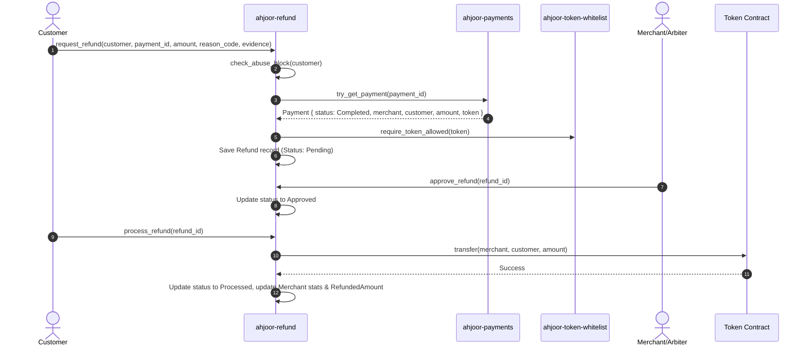
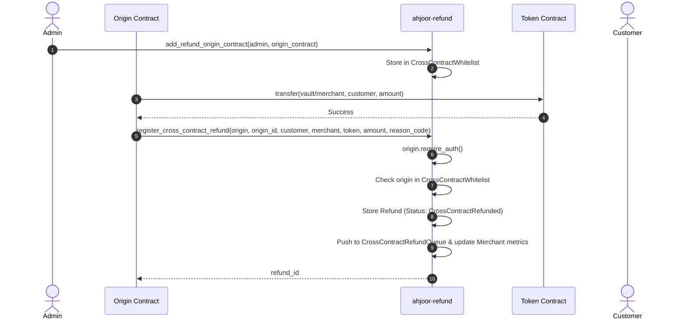
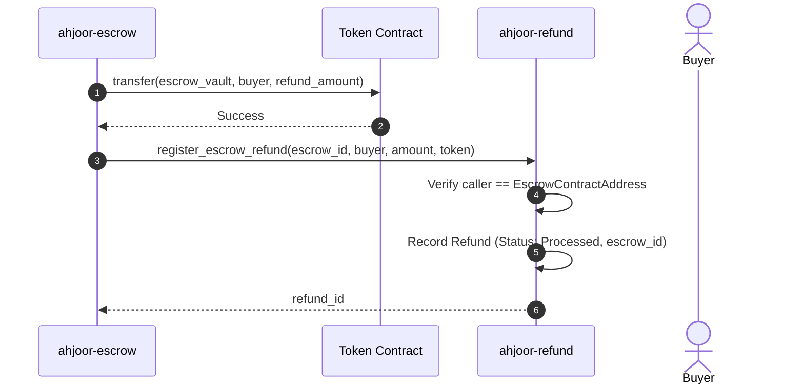

# Cross-Contract Refund Flow (`ahjoor-refund`)

This document details the architecture, call sequences, and failure modes for cross-contract interactions between `ahjoor-refund`, `ahjoor-payments`, `ahjoor-escrow`, token contracts, and whitelisted external origin contracts in the Ahjoor XMR protocol suite (`ussyalfaks/ahjoorxmr-contract`).

---

## Overview & Contract Dependencies

The `ahjoor-refund` contract functions as a central accounting, arbitration, and refund processing hub. While it operates autonomously for core refund operations, it interacts with several external contracts to validate transactions, execute token movements, and enforce security policies.

```
                   ┌───────────────────────────────┐
                   │     ahjoor-token-whitelist    │
                   └───────────────▲───────────────┘
                                   │ (whitelist check)
                                   │
┌──────────────────────────┐  (payment verification) ┌──────────────────────────┐
│     ahjoor-payments      │◄─────────────────────────┤      ahjoor-refund       │
└──────────────────────────┘                          └────────────┬─────────────┘
                                                                   │ (SEP-41 transfer)
┌──────────────────────────┐  (register_escrow_refund)             ▼
│      ahjoor-escrow       ├─────────────────────────►┌──────────────────────────┐
└──────────────────────────┘                          │   Stellar Token / SAC    │
                                                      └──────────────────────────┘
┌──────────────────────────┐ (register_cross_contract)             ▲
│ Whitelisted Origin Addr  ├────────────────────────────────────────┘
└──────────────────────────┘  (transfers funds directly)
```

### Which Contracts `ahjoor-refund` Calls Into and Why

1. **`ahjoor-payments` (`PaymentContractClient`)**
   - **Why Called:** During customer refund creation (`request_refund`) and merchant-initiated refunds (`merchant_refund`), `ahjoor-refund` calls into `ahjoor-payments` via `try_get_payment(&payment_id)`.
   - **Validation Scope:** 
     - Verifies that `payment_id` exists in the payment contract storage.
     - Enforces that payment status is `Completed`.
     - Retrieves the actual merchant address, customer address, token asset, and original payment amount to prevent fraud or parameter mismatch.

2. **Stellar Asset / Token Contracts (`soroban_sdk::token::Client`)**
   - **Why Called:** To execute actual on-chain token transfers for approved refunds and merchant reserve operations.
   - **Validation Scope:** 
     - Executed during `process_refund`, `approve_and_process_refund`, `merchant_refund`, `deposit_merchant_reserve`, and `withdraw_merchant_reserve`.
     - Calls `transfer(&from, &to, &amount)` or `transfer_from(&spender, &from, &to, &amount)`.

3. **`ahjoor-token-whitelist` (`TokenWhitelistClient`)**
   - **Why Called:** Validates whether the asset token used for payment/refund is actively supported by the protocol before processing refunds.
   - **Validation Scope:** Calls `is_whitelisted(&token)`. Returns `TokenNotWhitelisted` error if unapproved.

---

### Inbound Cross-Contract Invocations Into `ahjoor-refund`

1. **`ahjoor-escrow` (`register_escrow_refund`)**
   - **Why Invoked:** When an escrow contract dispute resolution or cancellation triggers a buyer refund, `ahjoor-escrow` calls `register_escrow_refund(escrow_id, buyer, amount, token)`.
   - **Authentication:** Enforces that `env.current_contract_address() == EscrowContractAddress`. Automatically sets status to `Processed`.

2. **Whitelisted Origin Contracts (`register_cross_contract_refund`)**
   - **Why Invoked:** Protocol extensions (such as multi-token invoices or custom settlement vaults) that handle their own token transfers internally can register completed cross-contract refunds into `ahjoor-refund` for centralized indexing, queuing, and merchant risk tracking.
   - **Authentication:** Requires explicit authorization from the origin contract (`origin_contract.require_auth()`) and validates that `origin_contract` is registered in `CrossContractWhitelist`.

---

## Call Sequences for Full Refund Flows

### 1. Customer-Initiated Payment Refund Flow (`request_refund` → `approve` → `process_refund`)



#### Step-by-Step Breakdown:
1. **Initiation:** Customer invokes `request_refund` with payment ID, requested refund amount, and reason code.
2. **Abuse Verification:** `ahjoor-refund` checks customer's abuse score. Rejects if customer is currently blocked (`CustomerBlockedForAbuse`).
3. **Payments Cross-Contract Query:** `ahjoor-refund` calls `PaymentsClient.try_get_payment(&payment_id)`. Verifies status == `Completed` and that `amount <= payment.amount - already_refunded`.
4. **Token Whitelist Query:** `ahjoor-refund` verifies `payment.token` against `ahjoor-token-whitelist`.
5. **Approval:** Merchant or Arbiter invokes `approve_refund(refund_id)`. Refund status moves to `Approved`.
6. **Token Transfer & Finalization:** `process_refund` invokes `token::Client::transfer` moving tokens from merchant balance/reserve to customer, marks refund `Processed`, and emits `RefundProcessed` event.

---

### 2. Whitelisted Origin Contract Cross-Contract Refund Flow (`register_cross_contract_refund`)

Used when an external contract handles token movement internally and notifies `ahjoor-refund` for record-keeping and audit trail.



#### Key Differences:
- **No Token Transfer inside `ahjoor-refund`:** The origin contract executes fund transfers prior to or alongside calling `register_cross_contract_refund`.
- **Status:** Created immediately in `CrossContractRefundStatus::CrossContractRefunded`.
- **Queueing:** Added to `CrossContractRefundQueue` for admin dashboard visibility.

---

### 3. Escrow Contract Direct Refund Flow (`register_escrow_refund`)



---

## Failure Modes & Transaction Atomicity

Soroban smart contracts execute within an **atomic transaction execution model**. If any cross-contract call panics, throws a Soroban error, or runs out of gas, **the entire transaction is reverted**, restoring all state mutations across all participating contracts to their pre-invocation state.

| Failure Mode / Error | Phase | Cause | Atomicity Behavior |
| :--- | :--- | :--- | :--- |
| `PaymentContractNotConfigured` | Cross-Contract Read | `PaymentContractAddress` key not initialized in `ahjoor-refund` storage. | Transaction reverts immediately. No refund record created. |
| `PaymentContractError` | Cross-Contract Read | `payment_id` does not exist in `ahjoor-payments` or `try_get_payment` failed. | Transaction reverts. Customer refund request aborted. |
| Payment Not Completed | Cross-Contract Validation | Payment in `ahjoor-payments` is in `Pending`, `Refunded`, or `Disputed` state. | Transaction panics (`"PaymentContractError: payment is not completed"`). Reverts cleanly. |
| `UnauthorisedOriginContract` | Cross-Contract Auth | Non-whitelisted caller invokes `register_cross_contract_refund`. | Call panics with `UnauthorisedOriginContract`. Entire origin transaction reverts. |
| Token Transfer Failure | Settlement / Token Call | Merchant balance insufficient, missing token trustline, or asset frozen. | Token contract panics. `ahjoor-refund` status is NOT updated to `Processed`. |
| `TokenNotWhitelisted` | Whitelist Check | Token asset failed whitelist check against `ahjoor-token-whitelist`. | Transaction panics with `TokenNotWhitelisted`. State reverted. |
| `ExceedsRefundableAmount` | State Validation | Total requested refund exceeds `payment.amount - already_refunded`. | Request rejected. Cumulative tracking protects against double refunds. |
| `CustomerBlockedForAbuse` | Pre-check | Customer abuse score exceeds `abuse_block_threshold`. | Call panics before executing any cross-contract calls into `ahjoor-payments`. |
| `ContractPaused` | Circuit Breaker | Emergency pause flag active on `ahjoor-refund`. | All state-changing cross-contract entrypoints panic immediately. |

---

## Admin Whitelist Management CLI Commands

Whitelisted origin contracts must be registered by an admin before they can call `register_cross_contract_refund`.

### Add Origin Contract to Whitelist:
```bash
stellar contract invoke \
  --id <REFUND_CONTRACT_ID> \
  --network testnet \
  --source admin \
  -- add_refund_origin_contract \
  --admin <ADMIN_ADDRESS> \
  --contract <ORIGIN_CONTRACT_ADDRESS>
```

### View Whitelisted Origin Contracts:
```bash
stellar contract invoke \
  --id <REFUND_CONTRACT_ID> \
  --network testnet \
  -- get_cross_contract_whitelist
```

### Remove Origin Contract from Whitelist:
```bash
stellar contract invoke \
  --id <REFUND_CONTRACT_ID> \
  --network testnet \
  --source admin \
  -- remove_refund_origin_contract \
  --admin <ADMIN_ADDRESS> \
  --contract <ORIGIN_CONTRACT_ADDRESS>
```

### Fetch Cross-Contract Refund Queue (Admin Pagination):
```bash
stellar contract invoke \
  --id <REFUND_CONTRACT_ID> \
  --network testnet \
  -- get_cross_contract_refund_queue \
  --page 0 \
  --page_size 50
```

---

## Verification & Code References

- Cross-Contract Refund Registration Implementation: [`contracts/ahjoor-refund/src/lib.rs`](file:///Users/mac/Lumenpulse/ahjoorxmr-contract/contracts/ahjoor-refund/src/lib.rs#L5072-L5182)
- Whitelist Administration: [`contracts/ahjoor-refund/src/lib.rs`](file:///Users/mac/Lumenpulse/ahjoorxmr-contract/contracts/ahjoor-refund/src/lib.rs#L5001-L5068)
- Cross-Contract Refund Unit Tests: [`contracts/ahjoor-refund/src/test_cross_contract_refund.rs`](file:///Users/mac/Lumenpulse/ahjoorxmr-contract/contracts/ahjoor-refund/src/test_cross_contract_refund.rs#L1-L147)
- Payment Validation Logic: [`contracts/ahjoor-refund/src/lib.rs`](file:///Users/mac/Lumenpulse/ahjoorxmr-contract/contracts/ahjoor-refund/src/lib.rs#L630-L660)
